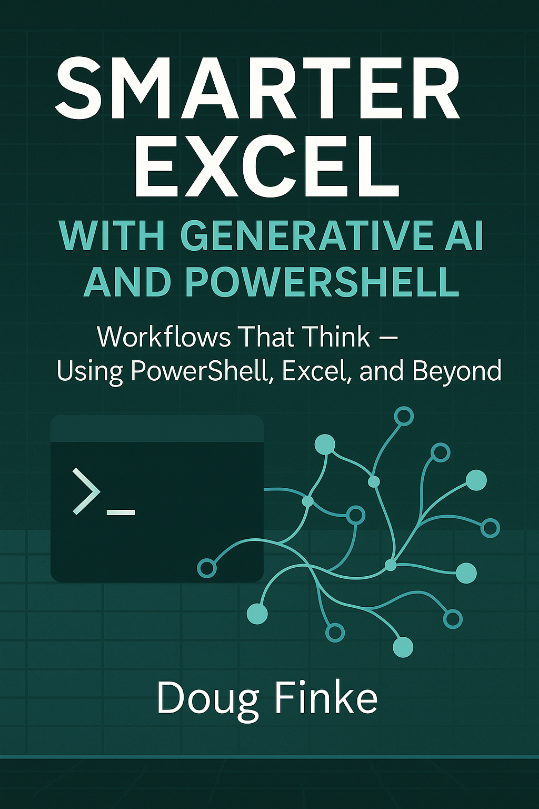

  
  <h2 style="margin-top:1rem; font-weight:normal;">Workflows That Think — Using PowerShell, Excel, and Beyond</h2>
  
An open book project by Doug Finke

## 📖 Chapters

- [Chapter 1: Why AI, Excel, and PowerShell](https://github.com/dfinke/Smarter-Excel-with-Generative-AI-and-PowerShell/blob/main/manuscript/chapter1.md)

---

## 💬 Join the Discussion

- [Share ideas or questions](https://github.com/dfinke/Smarter-Excel-with-Generative-AI-and-PowerShell/discussions)

---

## 📦 Featured PowerShell Modules

- [ImportExcel](https://github.com/dfinke/ImportExcel) – PowerShell module to import/export Excel spreadsheets, without Excel  
- [PSAISuite](https://github.com/dfinke/PSAISuite) – Unified interface to multiple Generative AI providers  
- [PSMCP](https://github.com/dfinke/PSMCP) – Turn PowerShell scripts into intelligent, conversational services
